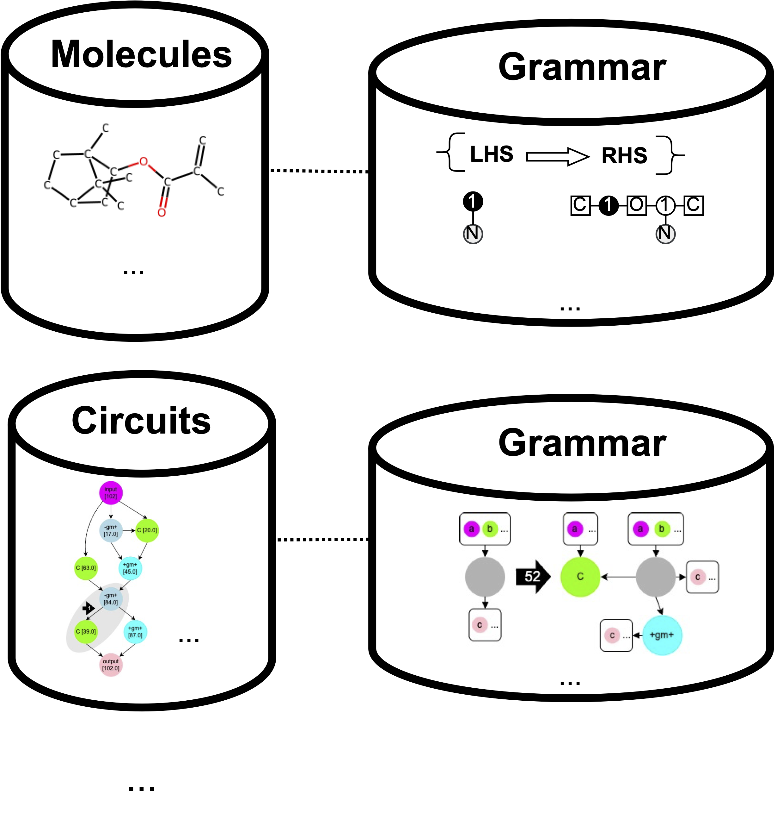

# Graph Grammar Induction Algorithms

This repo contains the codes for [Foundation Molecular Grammar: Multi-Modal Foundation Models Induce Interpretable Molecular Graph Languages](https://arxiv.org/abs/2505.22948) (ICML 2025) & [Directed Graph Grammars for Sequence-based Learning](https://arxiv.org/abs/2505.22949) (ICML 2025).

Graph Grammar Induction is the problem of learning grammar rules from a collection of graphs.

The grammar enables downstream applications like:
- Unconditional Generation via sampling rules
- Property Prediction via training on top of the parse-as-representation
- Optimization via latent space optimization

 We support several different grammar formalisms under src/algo/, including Hyperedge Replacement Grammar (hg) and Edge Directed Neighborhood Controlled Embedding (ednce). These are described in our two publications (FMG and DIGGED). We will continue to add more detailed documentation.
 
 We will grow the repository to support more algorithms. If you have any questions, feel free to make an Issue. If you'd like to get involved, contact msun415@mit.edu.

## Setup

1. git clone [this repo]
2. git submodule update --init --recursive
3. conda env create -f induction.yml
4. Install [PyTorch](https://pytorch.org/get-started/previous-versions/) and [PyG](https://pytorch-geometric.readthedocs.io/en/latest/install/installation.html).

## Run FMG

### Grammar Induction
1. conda activate induction
2. Add your OpenAI API key in ./notebooks/api_key.txt
3. export config=/home/msun415/induction/src/config/mol.yaml
4. python main.py --task learn --mol-dataset {dataset}

### Unconditional Generation
1. conda activate induction
2. export config=/home/msun415/induction/src/config/mol.yaml
3. python main.py --task generate --mol-dataset {dataaset} --num-samples {num_samples}

## Run DIGGED

### Grammar Induction
1. Download C version of [Subdue](https://ailab.wsu.edu/subdue/)
2. Put in ../subdue-5.2.2/ relative to repo
3. conda activate induction
4. export config=/home/msun415/induction/src/config/{dataset}.yaml
5. python main.py --task learn --dataset {dataset}

### Train DAGNN + Transformer VAE
1. conda env create -f dagnn_clone.yml
2. conda activate induction
3. export config=/home/msun415/induction/src/config/{dataset}.yaml
4. python train.py --dataset {dataset} --epochs 30 --cuda cuda:0

### Run BO
1. conda env create -f cktgnn.yml
2. conda env create -f cktgnn_r.yml (for BN)
3. python train.py --dataset {dataset} --epochs 30 --cuda cuda:0 --checkpoint 30

## Configure a new dataset

1. Make a new yml in src/config/, in same format as the other examples.
2. Add an elif block in load_data() in main.py
3. Write a load_{your dataset} function in src/examples/test_graphs.py
